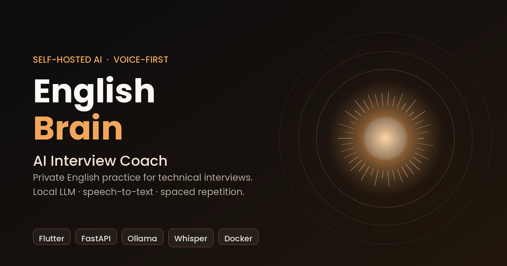
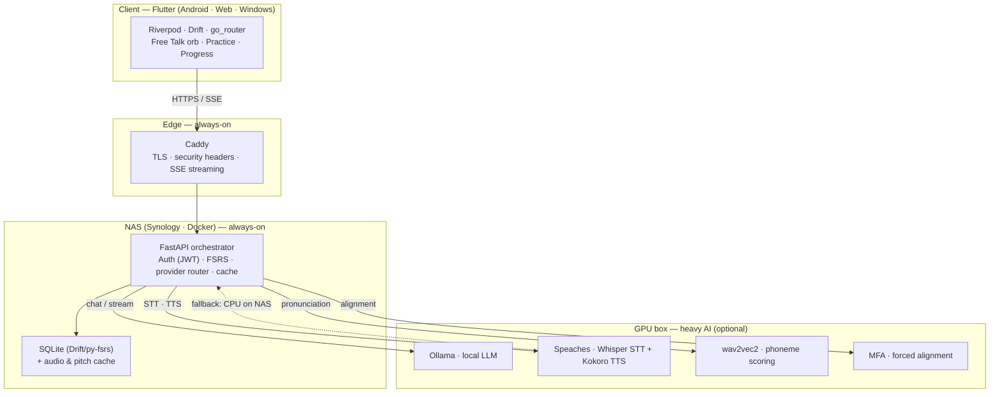

<div align="center">

# English Brain

**Your self-hosted AI coach for technical interviews in English — voice-first, private, and offline-capable.**

[](https://flutter.dev)
[](https://dart.dev)
[](https://fastapi.tiangolo.com)
[](https://www.python.org)
[](https://ollama.com)
[](https://github.com/speaches-ai/speaches)
[](https://www.docker.com)
[](https://caddyserver.com)
[](https://shorebird.dev)
[](LICENSE)

[](https://github.com/IvanjonasFC/English-Brain/actions/workflows/ci.yml)



</div>

---

> [!NOTE]
> **100% self-hosted.** English Brain runs entirely on your own hardware — a small always-on backend plus an optional GPU box for the heavy AI. Your voice, your answers and your progress **never leave your network**. There is no cloud account, no third-party API and no telemetry. The `.env.example` and every script in this repo ship with **placeholder** values (`TU_NAS_IP`, `ingles.tudominio.dev`, `CHANGE_ME_api_key`); fill them with your own before running.

## What is English Brain

English Brain is a private, self-hosted platform that trains you for **technical interviews in English**. Instead of a generic chatbot, it pairs a **voice-first AI coach** with a **pedagogical engine**: you *speak* your answers, it transcribes and evaluates your pronunciation phoneme by phoneme, gives structured feedback, and schedules what you need to review next with **spaced repetition** (the official [`py-fsrs`](https://github.com/open-spaced-repetition/py-fsrs) algorithm).

The whole system is designed around three ideas:

1. **Voice over text.** Interviews are spoken, so the core loop is spoken too. The home screen is a single calm **voice orb** — tap, talk, and the coach streams its reply back token by token while it speaks.
2. **Private by construction.** The LLM (Ollama), speech-to-text (Whisper) and text-to-speech (Kokoro) all run on your own machines. Nothing is sent to an external provider.
3. **Works when the network doesn't.** Content is cache-first with bundled offline seeds, so lessons and audio still load in airplane mode.

## Features

| Area | What it does |
|------|--------------|
| **Free Talk (voice orb)** | Single-focus voice chat with the AI coach. Tap-to-talk, live streaming replies (SSE), Kokoro TTS playback, and phonetic feedback — built to improve pronunciation and fluency |
| **Interview practice** | Structured technical-interview questions with model answers and AI evaluation of your spoken response |
| **Pronunciation engine** | Word- and phoneme-level scoring via wav2vec2, plus forced alignment (MFA) and native intonation curves precomputed per phrase |
| **Reading & Listening** | CEFR-tagged comprehension content with audio generated once and cached on the server |
| **Vocabulary & Grammar** | Phrasal verbs, irregular verbs, connectors and grammar drills, all speakable |
| **Spaced repetition (FSRS)** | Every item you practice is scheduled with `py-fsrs` so you review exactly when you're about to forget |
| **Progress tracking** | Streak, daily goal, sessions and minutes — including Free Talk sessions |
| **Offline-first** | Cache-first content with bundled seed JSON; the app stays usable with no backend reachable |
| **OTA updates** | Ship Dart + asset patches to installed phones over the air with Shorebird, no reinstall |

Extras: full **English / Spanish** localization, Material 3 theming (deep black `#000000` + warm orange `#F2A65A`), and a graceful-degradation provider router that keeps the app working when a service is down.

## Architecture



The backend is the single orchestrator: the Flutter client never talks to Ollama or Whisper directly. Heavy inference lives on an optional GPU box; the always-on NAS handles auth, scheduling, caching and graceful fallback (STT can fall back to CPU on the NAS; real LLM conversation needs the GPU box up). See [`docs/ARCHITECTURE.md`](docs/ARCHITECTURE.md) and [`docs/FRONTEND_ARCHITECTURE.md`](docs/FRONTEND_ARCHITECTURE.md) for the full design.

## Tech stack

**Client** — Flutter 3.11, Dart 3, Riverpod, `go_router`, Drift (SQLite), `just_audio`, `record`, `flutter_tts`, `fl_chart`, Shorebird code push.
**Backend** — FastAPI, Python 3.11, `py-fsrs` (spaced repetition), `httpx`, JWT auth, SQLite, Server-Sent Events for streaming.
**AI services** — [Ollama](https://ollama.com) (local LLM), [Speaches](https://github.com/speaches-ai/speaches) (Faster-Whisper STT + Kokoro-82M TTS), wav2vec2 (phoneme scoring), Montreal Forced Aligner (intonation).
**Infra** — Docker Compose, Caddy (automatic TLS + SSE), Synology NAS, optional WireGuard for remote access.

<details>
<summary>Repository layout (3 decoupled blocks)</summary>

```text
English-Brain/
├─ README.md · LICENSE (MIT) · CHANGELOG.md · SECURITY.md · CONTRIBUTING.md
├─ backend/                     # 1. FastAPI orchestrator
│  ├─ app/                      #    auth (JWT), FSRS, LLM, STT/TTS, routers, providers
│  ├─ tests/                    #    pytest suite
│  ├─ Dockerfile · requirements.txt
├─ nas/                         # 2. Infrastructure & deployment
│  ├─ docker-compose.yml        #    Ollama + Speaches + backend (+ optional Caddy)
│  ├─ Caddyfile                 #    reverse proxy, TLS, security headers, SSE
│  └─ .env.example              #    environment template (placeholders only)
├─ app/                         # 3. Flutter client (Android · Web · Windows)
│  ├─ lib/                      #    M3 theme, Riverpod, Drift, go_router, features/
│  ├─ android/ · web/ · windows/
│  ├─ assets/seed/              #    bundled offline content
│  └─ pubspec.yaml
├─ docs/                        # architecture, pedagogy, frontend, deployment, Shorebird
├─ scripts/ · tools/            # OpenAPI→Dart models, offline-seed sync
├─ assets/portada.png           # cover art
├─ Makefile                     # dev & deploy shortcuts
└─ .github/workflows/ci.yml      # CI (backend + app)
```

</details>

## Getting started

### Prerequisites

- **Flutter 3.11+** (Dart 3) on your `PATH` — `flutter doctor`
- **Python 3.11+** for the backend
- **Docker + Docker Compose** for the self-hosted services
- *(optional)* a **GPU box** with [Ollama](https://ollama.com) and [Speaches](https://github.com/speaches-ai/speaches) for real-time LLM + speech

### 1. Run the app (visual preview)

```bash
cd app
flutter run -d chrome     # Web — fastest, no emulator needed
flutter run -d windows    # native Windows desktop
flutter run               # Android device / emulator
```

Or with the shortcuts: `make run-app`, `make run-app-windows`.

The client reads its backend URL and key at build time via `--dart-define`:

```bash
flutter run --dart-define=BASE_URL=https://ingles.tudominio.dev --dart-define=API_KEY=YOUR_API_KEY
```

### 2. Run the backend (local dev)

```bash
# from the repo root
pip install -r backend/requirements.txt
pytest backend/tests -v
uvicorn app.main:app --app-dir backend --reload --host 0.0.0.0 --port 8000
```

- Swagger docs: `http://localhost:8000/docs`
- Health check: `http://localhost:8000/api/health`

### 3. Deploy the self-hosted stack (NAS / server)

```bash
cd nas
cp .env.example .env            # then edit .env with YOUR values
docker compose up -d            # Ollama + Speaches + backend
docker compose exec ollama ollama pull qwen2.5:7b   # first run only
docker compose ps
```

See [`docs/NAS_DEPLOYMENT.md`](docs/NAS_DEPLOYMENT.md) for reverse proxy, TLS, WireGuard and the GPU-box wiring.

### 4. Ship OTA updates (Shorebird)

```bash
# from the repo root — needs the `shorebird` CLI on your PATH
make shorebird-release   # first time: build a patchable release APK
make shorebird-patch     # afterwards: push Dart + asset patches over the air
```

Both wrap the `shorebird` CLI and inject `BASE_URL` / `API_KEY` via
`--dart-define`. Full flow (and the raw commands) in [`docs/SHOREBIRD.md`](docs/SHOREBIRD.md).

> [!IMPORTANT]
> Icon or font/asset changes require a **full Shorebird release**, not a patch — patches carry Dart + existing assets only. Bump `version` in `pubspec.yaml` for every new release.

## Privacy & security model

English Brain is built so your data stays yours:

- **No external AI.** LLM, STT and TTS run on hardware you control. No prompts, audio or answers are sent to any third-party API.
- **No telemetry.** The app phones home to nothing but your own backend.
- **Secrets stay out of the repo.** Every script and `docker-compose.yml` reads `BASE_URL`, `API_KEY`, IPs and SSH targets from environment variables with placeholder defaults — no real domain, key or internal IP is committed.
- **Hardened edge.** Caddy adds HSTS, `X-Frame-Options`, `X-Content-Type-Options` and a strict referrer policy; remote access can be limited to WireGuard.

See [`SECURITY.md`](SECURITY.md) to report a vulnerability.

## Documentation

| Document | What's inside |
|---|---|
| [`docs/ARCHITECTURE.md`](docs/ARCHITECTURE.md) | System architecture, interview loop and FSRS |
| [`docs/FRONTEND_ARCHITECTURE.md`](docs/FRONTEND_ARCHITECTURE.md) | Flutter UI: M3, Riverpod, Drift, routing |
| [`docs/PEDAGOGY.md`](docs/PEDAGOGY.md) | Adaptive pedagogical engine and functional paths |
| [`docs/NAS_DEPLOYMENT.md`](docs/NAS_DEPLOYMENT.md) | Self-hosted deployment with Docker + Caddy |
| [`docs/SHOREBIRD.md`](docs/SHOREBIRD.md) | Over-the-air updates and batch scripts |
| [`docs/GUIA_CONTENIDO.md`](docs/GUIA_CONTENIDO.md) | Authoring, CEFR tagging and content sync |

## Make shortcuts

| Command | Action |
|---|---|
| `make run-app` | Run the app in Chrome (Web) |
| `make run-app-windows` | Run the app as a native Windows window |
| `make run-backend` | Start the local FastAPI server |
| `make nas-up` / `make nas-down` | Start / stop the self-hosted containers |
| `make nas-logs` | Tail the container logs |
| `make test` | Run all tests (backend + app) |
| `make build-release-apk` | Build the obfuscated release APK |
| `make shorebird-patch` | Sync seeds and push an OTA patch |
| `make shorebird-release` | Build a new patchable Shorebird release |

## License

Distributed under the [MIT](LICENSE) license. Bundled and required third-party
components (Flutter, FastAPI, Ollama, Speaches/Whisper, Kokoro, py-fsrs, …) keep
their own licenses — see [NOTICE](NOTICE) for details.

<div align="center">
<sub>Built by <a href="https://github.com/IvanjonasFC">Iván Jonás Fernández Correa</a> · Gijón, Asturias</sub>
</div>
