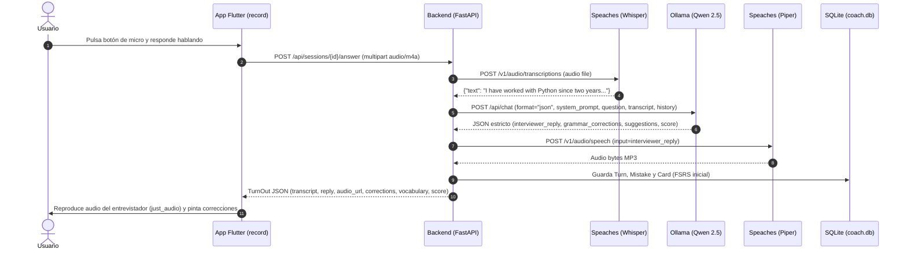

# Arquitectura del Sistema English Brain

Documentación técnica pensada para lectura directa o importación a tu vault de **Obsidian**.

---

## 1. Visión General de Punta a Punta

El sistema opera bajo el principio de **desacoplamiento total**: el cliente (Flutter en Android o Web) nunca se conecta directamente a los motores de inferencia (Ollama, Speaches o Whisper). Todo el tráfico se canaliza a través de un único orquestador central: la **English Brain API (FastAPI)**.

```mermaid
graph TD
    subgraph Cliente ["Cliente Móvil / Web (Flutter)"]
        A[Grabador de Voz: record] -->|Audio multipart m4a| B(English Brain API)
        C[Reproductor: just_audio] <--|Audio MP3 cacheado| B
        D[Repaso FSRS / Deck] <-->|JSON /api/cards| B
        E[Estadísticas & Gráficas] <--|JSON /api/stats| B
    end

    subgraph NAS ["Servidor Local / NAS (Docker Compose)"]
        B -->|OpenAI STT /v1/audio/transcriptions| F[Speaches / faster-whisper]
        B -->|Prompt forzado JSON /api/chat| G[Ollama: qwen2.5:7b]
        B -->|OpenAI TTS /v1/audio/speech| H[Speaches: Piper / Kokoro]
        B <-->|ORM SQLAlchemy aiosqlite| I[(SQLite: coach.db)]
        B -->|genanki / sync HTTP| J[AnkiConnect / .apkg]
    end
```

---

## 2. El Bucle Sagrado de la Entrevista

Cuando el usuario responde a una pregunta de la entrevista, el flujo exacto sigue esta secuencia:



---

## 3. Algoritmo de Repetición Espaciada: ¿Por qué FSRS en vez de SM-2?

SM-2 (desarrollado en 1987) asume factores de facilidad rígidos y multiplica intervalos de forma heurística, lo que genera sobre-repaso de tarjetas fáciles y olvido prematuro de conceptos difíciles.

**FSRS (Free Spaced Repetition Scheduler)** modela dos variables psicolingüísticas continuas basadas en la curva del olvido de D. R. Hermann Ebbinghaus:
- **Estabilidad ($S$)**: Días transcurridos hasta que la probabilidad de recuerdo cae al 90%.
- **Dificultad ($D$)**: Facilidad inherente con la que el cerebro retiene el concepto específico (1.0 a 10.0).

Cada error gramatical detectado por Ollama se convierte instantáneamente en una tarjeta con estado inicial `0 (New)`. Cuando el usuario la califica:
- **1 (Again)**: Resetea la estabilidad, suma un lapso (`lapses + 1`) y pasa a `Relearning`.
- **2 (Hard)**: Penaliza la estabilidad y mantiene el intervalo corto.
- **3 (Good)**: Escala la estabilidad según el factor óptimo.
- **4 (Easy)**: Otorga un bono de estabilidad extendiendo el intervalo de días para optimizar la retención.

---

## 4. Contrato JSON Sagrado del LLM

Para evitar que modelos de lenguaje de 7B o 9B rompan la respuesta con comentarios o markdown suelto, se imponen tres salvaguardas:
1. `format: "json"` nativo en la llamada a `/api/chat` de Ollama.
2. `temperature: 0.3` para máxima fidelidad y consistencia de formato.
3. Validación estricta con Pydantic (`LLMEvaluationResult`). Si el modelo emite un JSON mal formado, el servicio reintenta automáticamente antes de devolver error.
