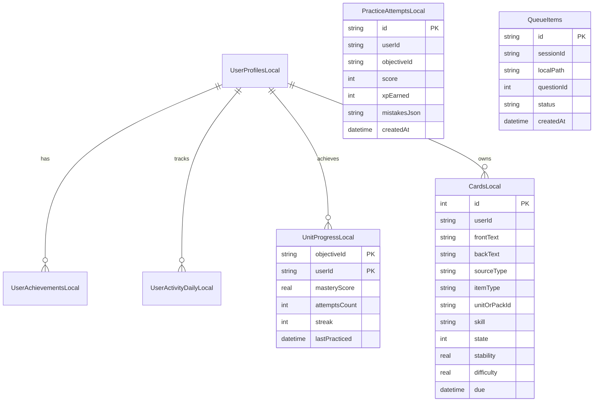

# Documentación de Arquitectura Frontend — English Brain

> **Propósito**: Guía técnica exhaustiva y canónica para desarrolladores e inteligencias artificiales que deban interpretar, mantener, refactorizar o extender la interfaz de usuario de **English Brain**.

---

## 1. Principios de Diseño y Arquitectura

1. **Feature-First**: El código está modularizado por dominio de negocio (`features/home`, `features/interview`, `features/vocabulary`, `features/grammar`, `features/deck`, `features/profile`, `features/auth`).
2. **Offline-First Duradero**: Todo el estado vital (cartas FSRS, intentos, progreso por objetivo, configuración de usuario y cola de audios) se persiste primero en base de datos local SQLite mediante **Drift**.
3. **Desacoplamiento Estricto con Backend**: El frontend se comunica exclusivamente con la API REST de FastAPI (`/api/v1`). La orquestación de IA (Ollama, Whisper, Piper/Edge TTS) está aislada en el servidor.
4. **Diseño Visual M3 Dark Glassmorphism**: Fondo negro puro (`#0D0F12`), tarjetas en gris oscuro azulado (`#161B22` / `#1F242C`), bordes delgados de baja opacidad (`rgba(255,255,255,0.08)`) y acentos cromáticos dedicados por módulo.
5. **Enfoque Pedagógico Adaptativo**: No se entrena por categorías planas sino por **objetivos comunicativos** reales con mezcla inteligente (70% objetivo / 20% repaso / 10% espaciado) gestionada por `PracticeEngine`.

---

## 2. Sistema de Diseño & Tokens (`core/theme/`)

### 2.1 Paleta Cromática Semántica por Módulo

| Módulo | Color Principal | Color Superficie | Border Tint | Propósito Visual |
| :--- | :--- | :--- | :--- | :--- |
| **Global / Base** | `#F2A65A` (Ámbar Pastel) | `#161B22` (Surface) | `#30363D` (Border) | Identidad corporativa, acentos generales y branding |
| **Entrevistas** | `#F59E0B` (Ámbar Tech) | `#261806` (Surface) | `#78350F` (Border) | Simulación técnica, feedback STAR, grabación de audio |
| **Vocabulario** | `#14B8A6` (Teal Petróleo) | `#042F2E` (Surface) | `#115E59` (Border) | Léxico técnico, flashcards, fonética IPA |
| **Gramática** | `#64748B` (Pizarra Slate) | `#0F172A` (Surface) | `#334155` (Border) | Estructuras funcionales, contraste de tiempos, drills |
| **Deck FSRS** | `#A855F7` (Violeta FSRS) | `#2E1065` (Surface) | `#6B21A8` (Border) | Repetición espaciada transversal, memoria a largo plazo |
| **Perfil** | `#FB7185` (Rosa Coral) | `#1F1720` (Surface) | `#4C1D24` (Border) | Analítica, racha, heatmap y multiusuario |

### 2.2 Tokens de Espaciado y Radios (`app_spacing.dart`, `app_radius.dart`)
- **Radios**: `AppRadius.sm` (8px), `AppRadius.md` (12px), `AppRadius.lg` (16px), `AppRadius.xl` (20px), `AppRadius.card` (22px).
- **Espaciados**: `AppSpacing.xs` (4px), `AppSpacing.sm` (8px), `AppSpacing.md` (16px), `AppSpacing.lg` (24px), `AppSpacing.xl` (32px).
- **Tipografía**: Basada en `Outfit` / `Inter` con pesos `FontWeight.w500` para cuerpo y `FontWeight.bold` para títulos, optimizada para legibilidad en fondos oscuros.

---

## 3. Topología de Rutas y Navegación (`core/router/app_router.dart`)

La navegación utiliza `go_router` con una estructura de **ShellRoute** que mantiene persistente la barra de navegación inferior (`ScaffoldWithNavBar`):

```mermaid
graph TD
    Root[App Startup: initialLocation='/'] --> Redirect{¿Autenticado?}
    Redirect -->|No tiene credenciales| Login[/login]
    Redirect -->|Primera vez| Onboarding[/onboarding]
    Redirect -->|Autenticado| Shell[ShellRoute: ScaffoldWithNavBar]

    subgraph "Bottom Navigation Bar (6 Destinos)"
        Shell --> Tab0["/ (Home: Next Best Action)"]
        Shell --> Tab1["/interview (Hub de Entrevistas)"]
        Shell --> Tab2["/vocabulary (Hub de Vocabulario)"]
        Shell --> Tab3["/grammar (Hub de Gramática)"]
        Shell --> Tab4["/deck (Mazo FSRS Transversal)"]
        Shell --> Tab5["/profile (Perfil y Analítica)"]
    end

    subgraph "Subrutas de Flujo Específico"
        Tab1 --> IntSession["/interview/session (Simulador en Vivo)"]
        Tab1 --> IntPack["/interview/pack-intro (Pantalla Intermedia de Pack)"]
        Tab2 --> VocabPractice["/vocabulary/practice (Runner de Tarjetas)"]
        Tab3 --> GramPractice["/grammar/practice (Drill Duolingo-style)"]
    end

    subgraph "Herramientas de Soporte"
        Shell -.-> Dictation["/dictation (Dictado en Audio)"]
        Shell -.-> Shadowing["/shadowing (Shadowing)"]
        Shell -.-> Stats["/stats (Historial de Sesiones)"]
        Shell -.-> Settings["/settings (Ajustes de Servidor)"]
    end
```

---

## 4. Gestión de Estado y Capa de Datos (`core/providers/app_providers.dart`)

English Brain combina **Riverpod** para la inyección reactiva y **Drift** para la persistencia transaccional offline:

### 4.1 Principales Providers

| Provider | Tipo | Propósito |
| :--- | :--- | :--- |
| `appDatabaseProvider` | `Provider<AppDatabase>` | Singleton de la base de datos local Drift SQLite (Wasm en Web, SQLite3 en Android/iOS/Desktop). |
| `apiClientProvider` | `Provider<ApiClient>` | Cliente HTTP Dio configurado con interceptores de Auth, reintentos exponenciales y timeouts. |
| `audioRecorderProvider` | `ChangeNotifierProvider` | Controlador de micrófono (AudioRecorder), vúmetro de amplitud y codificación mono optimizada. |
| `audioPlayerProvider` | `ChangeNotifierProvider` | Reproductor de audio (just_audio), resolución dinámica de URL y síntesis TTS con Edge Neural. |
| `activeUserIdProvider` | `StateProvider<String>` | ID del usuario actualmente activo (ej. `'user-ivan'`) para aislamiento total multiusuario. |
| `profileSummaryProvider` | `FutureProvider` | Orquestador de métricas: XP, racha, habilidades, horas, sesiones y estado de sync. |
| `practiceServiceProvider` | `Provider<PracticeService>` | Lógica de negocio para registrar intentos, calcular deltas de maestría (`PracticeImprovement`) e invalidar providers. |
| `reviewIngestionProvider` | `Provider<ReviewIngestionService>` | Ingesta unificada de fallos (gramática, vocabulario, entrevistas) en el mazo transversal FSRS. |
| `localeProvider` | `StateProvider<Locale>` | Locale activo (`Locale('es')` o `Locale('en')`), consumido por `AppLocalizations`. |

---

## 5. Distribución de la Interfaz por Módulo

### Módulo 0: Shell de Navegación (`ScaffoldWithNavBar`)
- **Estructura**: `Scaffold` envolvente con `body: child` y `bottomNavigationBar: NavigationBar`.
- **Destinos (6)**:
  1. `Inicio` (`Icons.grid_view_rounded`)
  2. `Entrevista` (`Icons.mic_rounded`)
  3. `Vocabulario` (`Icons.menu_book_rounded`)
  4. `Gramática` (`Icons.text_fields_rounded`)
  5. `Mazo FSRS` (`Icons.style_rounded`)
  6. `Perfil` (`Icons.person_rounded`)
- **Comportamiento**: Transición suave sin recrear el estado de las pestañas hijas; detección reactiva de la ruta para iluminar el icono activo.

---

### Módulo 1: Inicio (`features/home/home_screen.dart`)
El **centro real de decisión** al estilo Duolingo que guía la sesión diaria sin fricción técnica.

1. **Header Hero Dinámico (`_buildTopHeader`)**:
   - Píldoras superiores de racha activa (`🔥 X días`), XP acumulado (`⚡ X XP`) y nivel objetivo (`CEFR B2/C1`) consumidos reactivamente de `profileSummaryProvider`.
   - Saludo personalizado y avatar circular.
2. **Tarjeta de Siguiente Mejor Acción ("Continuar Aprendizaje" en 1 toque)**:
   - Título de la acción prioritaria recomendada por el algoritmo adaptativo (ej. *"Unit 3: Past Simple in STAR Stories"*).
   - Badge contextual **"Por qué ahora"**: explica con claridad por qué esa lección es prioritaria según el intervalo de olvido o errores pasados.
   - Botón directo de 1 toque para arrancar la lección de inmediato.
3. **Mini Path Horizontal de Progresión**:
   - Nodos secuenciales visuales de avance (Unidades completadas con check verde, unidad actual pulsante y examen checkpoint).
4. **Repaso Pendiente Hoy (Practice Hub)**:
   - Smart card destacada con acceso rápido a 5 tarjetas FSRS listas para consolidar errores recientes de entrevistas orales.
5. **Ruta Guiada del Día: 3 Acciones Recomendadas (1 Toque)**:
   - *Entrevista recomendada*: Pack destacado (ej. `STAR Storytelling & Leadership`) con botón de inicio directo a briefing.
   - *Ruta gramatical recomendada*: Objetivo comunicativo activo (ej. `Hablar de proyectos pasados`) con inicio a drills interactivos.
   - *Vocabulario diario*: Pack de léxico clave con transcripción fonética IPA y audio neural.
6. **Exploración Secundaria Plegable**:
   - Acordeón expansible discreto para acceder al catálogo completo de los 10 packs, 32 unidades y recursos de biblioteca curada sin sobrecargar la pantalla principal.

---

### Módulo 2: Entrevistas (`features/interview/`)
Centro de entrenamiento de entrevistas técnicas y conductuales estructurado en 3 capas.

```
features/interview/
├── interview_hub_screen.dart        <- Hub simplificado con 1 Hero, 3 packs y personalización en 2ª capa
├── interview_pack_intro_screen.dart <- Pantalla intermedia pedagógica obligatoria antes de hablar
└── interview_screen.dart            <- Simulador en tiempo real con grabación y evaluación
```

#### A. `InterviewHubScreen` (`#/interview`)
- **1 Hero Principal de "Práctica Recomendada"**:
  - En la parte superior: tarjeta con la simulación rápida adaptativa según el nivel del usuario.
  - Botón de 1 toque **"Continuar Práctica"** para entrar directo al simulador.
- **Packs Pedagógicos Recomendados (Máximo 3 visibles + toggle)**:
  - Muestra únicamente los 3 packs prioritarios:
    - *STAR Storytelling & Leadership* (Conductual / HR)
    - *System Design Trade-offs & Scalability* (Diseño de Sistemas)
    - *Live Incident Walkthrough & Debugging* (Troubleshooting técnico)
  - Botón secundario *"Ver más packs"* para expandir o contraer los packs adicionales.
  - Tapping en cualquier pack abre obligatoriamente `InterviewPackIntroScreen` antes de hablar.
- **Personalización Manual en 2ª Capa (`_openCustomizeSessionSheet`)**:
  - Se eliminan los selectores estáticos invasivos del flujo principal.
  - Tarjeta discreta con botón **"Ajustar sesión"** que despliega un `ModalBottomSheet` con los 4 modos, 4 niveles y 13 dominios técnicos cuando el usuario desea una configuración a medida.

#### B. `InterviewPackIntroScreen` (`#/interview/pack-intro`)
- Pantalla intermedia inspirada en el briefing previo a drills de Duolingo:
  - **Hero Card**: Título del pack, descripción profunda, badges de Escenario, Nivel CEFR, Duración estimada y Modo.
  - **Objetivo Comunicativo**: Qué se espera que demuestre el candidato.
  - **Habilidades Evaluadas**: Chips semánticos (ej. `Trade-offs`, `Scalability`, `Conditional Clauses`).
  - **Enfoque de Evaluación de la IA**: Criterios objetivos con los que el LLM calificará la respuesta.
  - **Consejos Tácticos (Tips)**: Frases clave recomendadas (*"On one hand... However, the trade-off is..."*).
  - **CTA Inferior Flotante**: *"Empezar Entrenamiento"* que inicializa la sesión.

#### C. `InterviewScreen` (`#/interview/session`)
- **Cabecera**: Pregunta del entrevistador en texto y audio con botón de reproducción (`just_audio`).
- **Badge `engine_used`**: Chip dinámico en la parte superior derecha de cada respuesta evaluada:
  - `Motor rápido (GPU)` con icono de rayo ámbar si fue inferido por aceleración local/worker.
  - `Motor estándar` si se procesó por fallback CPU.
- **Área Central de Grabación**:
  - Indicador de estado: *Idle*, *Grabando (vúmetro de amplitud activo)*, *Subiendo / Evaluando*, *Feedback recibido*.
  - Botón flotante central de micrófono con pulsación reactiva al volumen de voz.
- **Bloque de Retroalimentación Inmediata (`_buildFeedbackSection`)**:
  - Puntuación global (0-100) y desglose en *Estructura STAR*, *Fluidez*, *Vocabulario Técnico* y *Gramática*.
  - Correcciones gramaticales interactivas (*"Lo que dijiste"* en rojo vs *"Cómo decirlo mejor"* en verde).
  - Sugerencias de vocabulario técnico de mayor nivel con explicación y botón de audio.
  - Respuesta conversacional de la IA con audio generado automáticamente por TTS.

---

### Módulo 3: Vocabulario (`features/vocabulary/`)
Dominio de léxico de ingeniería organizado por necesidad comunicativa con modos Learn y Practice.

#### A. `VocabularyHubScreen` (`#/vocabulary`)
- **4 Bloques Funcionales de Entrada Directa**:
  1. **Nuevas palabras para tu objetivo actual**: Términos clave para la siguiente sesión de entrevista.
  2. **Palabras con dificultad / Falladas**: Errores detectados en sesiones orales y tarjetas FSRS en riesgo de olvido.
  3. **Frases y modismos de entrevista**: Phrasal verbs y modismos de negociación técnica (*"touch base"*, *"trade-off"*, *"bottleneck"*).
  4. **Verbos irregulares & action verbs**: Verbos clave en pasado y participio para relatar historias STAR (*built*, *led*, *scaled*, *spearheaded*).
- **Acciones Primarias en Cada Bloque**:
  - Botón `Aprender (Learn)`: Abre las flashcards interactivas con transcripción IPA y audio dual normal/lento.
  - Botón `Practicar (Quiz)`: Abre el runner interactivo de práctica.
- **Exploración Secundaria**:
  - Sección inferior con filtros de nivel y cuadrícula completa de los 10 packs temáticos para cuando el usuario desea explorar libremente.
- **Herramientas de Acompañamiento (`_buildCompanionToolsSection`)**:
  - Enlaces a herramientas complementarias: *Entrenador de Fonética IPA*, *Dictado de Código* y *Mazo FSRS*.

#### B. `VocabularyScreen` y `FlipVocabularyCard`
- **Carrusel de Flashcards 3D**:
  - **Frente**: Término en inglés destacado en grande, transcripción fonética IPA, categoría gramatical y botón de audio con velocidad normal (`1.0x`) o lenta (`0.8x`).
  - **Dorso (Flip con animación de perspectiva)**: Definición clara en contexto IT, traducción al español, oración de ejemplo en sistemas reales (con botón de reproducción de audio) y términos relacionados / sinónimos de ingeniería.
  - **Evaluación FSRS en Vivo**: Botones de calificación de recuerdo (*Again*, *Hard*, *Good*, *Easy*) que actualizan la curva de olvido inmediatamente.

---

### Módulo 4: Gramática (`features/grammar/`)
Rutas funcionales de comunicación técnica estructurada organizadas por objetivos reales.

#### A. `GrammarHubScreen` (`#/grammar`)
- **Rutas Funcionales Comunicativas**:
  - Se quita el protagonismo a los tabs de nivel académico y se priorizan las rutas funcionales:
    1. *Hablar de proyectos pasados* (Past Simple vs Present Perfect).
    2. *Describir experiencia y trayectoria* (Present Perfect Continuous).
    3. *Explicar causas y resultados de incidentes* (Connectors & Cause-Effect).
    4. *Troubleshooting hipotético y post-mortems* (Conditionals & Inversion).
  - El nivel CEFR (`A2-B1`, `B1-B2`, `B2-C1`, `C1`) se muestra como badge secundario discreto.
- **Estructura Interna de Cada Ruta**:
  - **Guidebook**: Nota breve y concisa de la función comunicativa.
  - **Contrastes Clave**: Comparativas visuales claras de uso técnico.
  - **Errores Hispanohablantes Típicos**: Estructuras incorrectas tachadas en rojo frente a alternativas naturales en verde.
  - **Acción Directa**: Botón para iniciar drills interactivos y mini speaking oral.

#### B. `GrammarPracticeScreen`
- **Runner Interactivo Duolingo-Style**:
  - Barra de progreso superior animada (`Step X de Total`).
  - Preguntas de selección múltiple, completar huecos y corrección de frases.
  - Evaluación inmediata con fondo verde/rojo tras cada selección.
- **Ingesta Automática a FSRS**: Cada respuesta errónea se convierte de inmediato en una tarjeta de revisión en Drift mediante `ReviewIngestionService`.
- **Mini Speaking Prompt Final**: Al concluir los ejercicios escritos, se presenta una consigna oral para consolidar el objetivo hablando.
- **Pantalla de Finalización ("Qué has mejorado")**:
  - Tarjeta de progreso con incremento de maestría (+X%), XP ganado y racha.
  - Invalida `profileSummaryProvider` para que Home y Perfil reflejen el avance de inmediato.

---

### Módulo 5: Mazo FSRS como Review Hub (`features/deck/deck_screen.dart`)
Centro unificado de consolidación de errores y memoria a largo plazo.

- **Review Hub Header ("Centro de Consolidación")**:
  - Indicador de tarjetas pendientes hoy.
  - **Sesión Rápida de 5 Cartas (1 toque)**: Acción prioritaria para consolidar rápido sin pensar.
- **Segmentación por Origen del Error**:
  - *Errores de Entrevistas Recientes* (STAR, vacilaciones).
  - *Correcciones Gramaticales de Drills* (`sentenceCorrection`).
  - *Vocabulario en Riesgo de Olvido* (baja estabilidad FSRS).
- **Filtros Sutiles Horizontales**:
  - Píldoras discretas para filtrar por habilidad (*Todos*, *Vocabulario*, *Gramática*, *Entrevistas*).
- **Botones de Calificación FSRS**:
  - `Again (1)` (Rojo) — Olvido total, resetea estabilidad.
  - `Hard (2)` (Naranja) — Recordado con gran esfuerzo.
  - `Good (3)` (Verde) — Retención exitosa en tiempo esperado.
  - `Easy (4)` (Azul) — Retención perfecta sin vacilación.

---

### Módulo 6: Perfil & Analítica (`features/profile/profile_screen.dart`)
Panel de control de progreso individual y soporte multiusuario.

- **Header Profesional (`_buildHeaderBlock`)**:
  - Avatar, nombre del usuario activo, rol tecnológico, nivel CEFR objetivo, meta diaria (min/día) y píldora de sincronización con NAS.
  - Botón de **Cambio de Usuario** (`Icons.swap_horiz_rounded`): abre un modal inferior para alternar entre perfiles (`Iván`, `Elena`, `Invitado`) o crear uno nuevo con almacenamiento aislado en Drift.
- **Progreso Global (`_buildGlobalProgressBlock`)**:
  - Animación count-up en Total XP, XP Semanal, Racha actual y Horas totales dedicadas.
- **Métricas Clave 2x2 (`_buildQuickStatsGrid`)**:
  - Sesiones completadas, Unidades superadas, Vocabulario consolidado y Puntuación de claridad oral.
- **Dominio por Habilidad (`_buildSkillsBreakdownBlock`)**:
  - Barras de progreso animadas: *Grammar & Structure*, *Technical Vocabulary*, *Listening & Comprehension*, *Speaking & Pronunciation*.
- **Heatmap de Consistencia 30 Días (`_buildActivityCalendarBlock`)**:
  - Gráfico de barras de los últimos 7 días con XP ganado por jornada y cuadrícula de calor de los últimos 30 días.
- **Carrusel de Logros (`_buildAchievementsBlock`)**:
  - Badges desbloqueados con checkmark dorado y badges en progreso con porcentaje de llenado.
- **Ajustes del Sistema (`_buildSettingsSection`)**:
  - Configuración del motor de audio Speaches/Edge, sincronización NAS, exportador Anki/Obsidian y selector de idioma UI (ES / EN).

---

### Módulo 7: Autenticación & Servidor (`features/auth/`)
- **`LoginScreen`**:
  - Presets rápidos de red con un toque: *LAN Casa (`192.168.1.50:8000`)*, *WireGuard VPN (`10.8.0.1:8000`)*, *HTTPS Caddy*, *Local PC (`localhost:8000`)*.
  - Validación de conectividad en vivo con botón "Probar Conexión" que mide la latencia en milisegundos y el estado de los microservicios.
  - Manejo de errores humanizados (distingue servidor no alcanzable de credencial inválida).

---

## 6. Arquitectura de Audio: Grabación y Reproducción

### 6.1 Grabación (`AudioRecorderController.dart`)
- **Web**: Graba audio en memoria mediante `AudioEncoder.opus` a **48 kbps Mono** (compatibilidad nativa en navegadores móviles y desktop).
- **Móvil / Desktop**: Graba archivo `.m4a` mediante `AudioEncoder.aacLc` a **64 kbps Mono** en `getTemporaryDirectory()`.
- **Pre-procesamiento de Voz**: Activados `autoGain: true`, `echoCancel: true`, `noiseSuppress: true` para maximizar la tasa de acierto de Whisper y eliminar ruidos de fondo.
- **Subida Dual en `ApiClient`**:
  - Web: Lectura de bytes desde el Blob URL (`MultipartFile.fromBytes`).
  - Nativo: Streaming desde el archivo en disco (`MultipartFile.fromFile`).

### 6.2 Reproducción & Síntesis (`AudioPlayerController.dart`)
- **Resolución Dinámica de URL**: Lee la URL base activa de `LocalCacheService` en lugar de direcciones fijas.
- **Motor Primario**: Microsoft Edge Neural TTS en backend (`/api/tts`), con voces de estudio `en-US-GuyNeural` y `en-US-JennyNeural`.
- **Sanitización de Velocidad**: Normaliza automáticamente parámetros de velocidad (`rate=0` o `rate=-20` para pronunciación lenta fonética).
- **Caché Inteligente con Umbral**: Archivos en `audio_cache/` de más de 100 bytes se sirven instantáneamente; archivos menores o nulos se regeneran al vuelo.
- **Restablecimiento Automático de Estado**: Al terminar la pista o ante errores de red, el icono del altavoz regresa a su estado inactivo para evitar bloqueos visuales.

---

## 7. Esquema de Datos Drift Local (`core/database/app_database.dart`)



---

## 8. Guía para Extender o Modificar la Interfaz (Checklist para IA/Devs)

Al añadir nuevas pantallas, widgets o cambiar interfaces existentes, sigue rigurosamente este checklist:

1. **Tokens de Color**: No introduzcas colores hexadecimales sueltos en los widgets. Emplea los tokens definidos en `AppTheme` (`AppTheme.primary`, `AppTheme.interviewAmber`, `AppTheme.vocabTeal`, `AppTheme.grammarSlate`, etc.).
2. **Textos Localizados (i18n)**: No escribas cadenas de texto hardcodeadas en widgets. Añade la clave en `app_es.arb` y `app_en.arb`, ejecuta `flutter gen-l10n` y consúmela vía `context.l10n.miClave`.
3. **Persistencia Multiusuario**: Siempre que persistas una entidad en Drift o hagas una petición a backend, asocia el registro al `activeUserIdProvider`.
4. **Invalidación de Progreso**: Tras completar un ejercicio, llama a `ref.invalidate(profileSummaryProvider)` para que el dashboard y el perfil se sincronicen de inmediato.
5. **Ciclo de Validación con el Compilador**:
   ```powershell
   cd app
   flutter gen-l10n
   dart analyze        # Debe arrojar: "No issues found!"
   flutter test        # Debe pasar el 100% de la suite
   flutter build web --release
   ```
