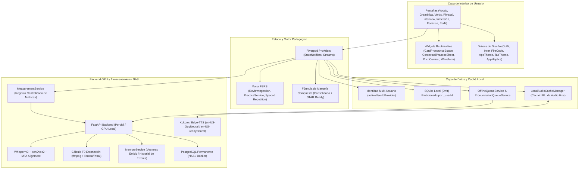

# Arquitectura Integral y Guía Maestra de Desarrollo — English Brain

Esta guía documenta la **arquitectura técnica completa, subsistemas globalizados, patrones de diseño y estándares obligatorios** para el desarrollo de nuevas funciones y pestañas en **English Brain**.

---

## 1. Mapa de Subsistemas Globalizados



---

## 2. Los 10 Pilares Técnicos y Obligatorios

### Pilar 1: Partición Estricta por Usuario (`_userId`)
- **Regla**: Nunca ejecutar una consulta SQLite ni enviar un registro al backend sin el `userId` activo (`ref.read(activeUserIdProvider)`).
- **Impacto**: La conmutación de perfiles en [Perfil](file:///c:/Users/IvN/Desktop/Ingles/app/lib/features/profile/profile_screen.dart) actualiza toda la interfaz en tiempo real sin reiniciar la aplicación ni mezclar datos de estudio.

### Pilar 2: Caché Local LRU de Audio ([`LocalAudioCacheManager`](file:///c:/Users/IvN/Desktop/Ingles/app/lib/core/audio/local_audio_cache_manager.dart))
- **Regla**: Cualquier reproducción de voz debe pasar por `AudioPlayerController.playTts()`.
- **Comportamiento**:
  1. Comprueba si el audio ya existe en la caché local (`/audio_cache/<hash>.mp3`).
  2. Si existe: Reproducción instantánea con **0 ms de latencia** y offline.
  3. Si no existe: Lo descarga del backend, lo almacena en el disco local LRU y lo reproduce.
  4. Si el backend está apagado o reiniciándose: Conmuta limpiamente a TTS nativo del sistema.

### Pilar 3: Resiliencia Offline y Colas de Fondo
- **Regla**: La app **nunca debe bloquearse ni mostrar error fatal** si el backend se reinicia o no hay conexión.
- **Componentes**:
  - [`OfflineQueueService`](file:///c:/Users/IvN/Desktop/Ingles/app/lib/core/audio/offline_queue_service.dart): Guarda mutaciones de mazo, tarjetas y progreso.
  - [`PronunciationQueueService`](file:///c:/Users/IvN/Desktop/Ingles/app/lib/core/audio/pronunciation_queue_service.dart): Almacena grabaciones de voz no evaluadas para procesamiento en segundo plano al reconectar.

### Pilar 4: Ciclo Multimodal FSRS y Fórmula de Maestría Compuesta
- **Regla**: El dominio de un término o estructura exige producción activa multimodal, no memorización pasiva.
$$\text{Mastery} = 0.20 \cdot \text{Significado} + 0.25 \cdot \text{Contexto} + 0.20 \cdot \text{Listening} + 0.15 \cdot \text{Sintaxis} + 0.10 \cdot \text{Pronunciación} + 0.10 \cdot \text{Speaking}$$
- **Estados obligatorios**:
  - `Consolidado` (`isMastered`): $\ge 80\%$, aciertos multimodales y prueba en días distintos (`recallDates.length >= 2`).
  - `Listo para Entrevista` (`isInterviewReady`): Requiere estar consolidado **Y** al menos 1 respuesta oral técnica grabada (`speakingCount >= 1`).
- **Enrutamiento FSRS**: Usar `itemType` específico (`contextual_meaning`, `word_order`, `listening`, `pronunciation`, `speaking`, `single_word`).

### Pilar 5: Componentes Unificados de Pronunciación y Fonética
Toda pantalla que incluya vocabulario, verbos, frases o gramática debe integrar:
1. [`CardPronounceButton`](file:///c:/Users/IvN/Desktop/Ingles/app/lib/core/widgets/card_pronounce_button.dart): Botón compacto en cada tarjeta (Micrófono, estado de grabación, spinner de análisis y badge con score `%`).
2. [`ContextualPronunciationPracticeSheet`](file:///c:/Users/IvN/Desktop/Ingles/app/lib/core/widgets/contextual_pronunciation_practice_sheet.dart): Modal completo con:
   - Navegación entre frases contextuales (`1/4`, base, pasado, incidencia, STAR).
   - `Hear model` (1.0x) con voz `en-US-GuyNeural`.
   - `Slow (0.8x)` para entrenamiento fonético detallado.
   - `Record` con animación de grabación.
   - `My recording` para escuchar y comparar la propia producción.
   - Desglose de fonemas con enlace directo a ejercicios de discriminación auditiva [HVPT](file:///c:/Users/IvN/Desktop/Ingles/app/lib/features/phonetics/hvpt_exercise_screen.dart).
   - Curva de entonación F0 [`PitchComparatorPanel`](file:///c:/Users/IvN/Desktop/Ingles/app/lib/core/widgets/pitch_contour_chart.dart).

### Pilar 6: Telemetría Centralizada con [`MeasurementService`](file:///c:/Users/IvN/Desktop/Ingles/app/lib/core/services/measurement_service.dart)
- Toda métrica de voz (`pitch_similarity`, `gop_score`, `stt_fluency`, `star_score`, `hvpt_accuracy`) se envía al `MeasurementService` para alimentar:
  - La evolución de voz en [Perfil](file:///c:/Users/IvN/Desktop/Ingles/app/lib/features/profile/profile_screen.dart).
  - El mapa de calor de fonemas débiles.
  - La curva de retención global.

### Pilar 7: Memoria Vectorial Embic y Diagnóstico IA
- **Regla de Recomendación**: Las sugerencias en [Inicio](file:///c:/Users/IvN/Desktop/Ingles/app/lib/features/home/home_screen.dart) y [Perfil](file:///c:/Users/IvN/Desktop/Ingles/app/lib/features/profile/profile_screen.dart) no deben ser textos genéricos; se generan a partir del historial real de fallos (`MemoryService`).
- **Formato Estándar de Feedback IA**:
  - `• Fortaleza`: Qué se articuló correctamente en el contexto técnico.
  - `• Naturalness / Mejora`: Cómo conectar sonidos o ajustar registro.
  - `• Frase Modelo`: Ejemplo listo para usar en reuniones o entrevistas.
- **Salvaguardas de IA**:
  - **Timeout estricto de 4 segundos** en llamadas al LLM para consejos dinámicos (evita estados de carga infinitos).
  - **Filtro de confianza STT**: Si la señal de audio es baja o ruidosa, nunca catalogar la pronunciación como incorrecta; indicar amablemente verificar el micrófono.

### Pilar 8: Experiencia Táctil Háptica ([`AppHaptics`](file:///c:/Users/IvN/Desktop/Ingles/app/lib/core/theme/app_haptics.dart))
- Añadir feedback háptico en interacciones clave:
  - `AppHaptics.light()`: Pulsaciones en chips, filtros, navegación y audio.
  - `AppHaptics.medium()`: Aciertos en drills y arranque de grabación.
  - `AppHaptics.error()`: Respuestas incorrectas y fallos de validación.

### Pilar 9: Estética Profesional y Regla de Cero Emojis
- **Prohibición Total de Emojis**:
  - Ni en pantallas de usuario, ni en tarjetas, ni en textos de datos, ni en modelos, ni en tests.
  - Usar exclusivamente iconos vectoriales limpios de `Icons.*` (`Material Symbols`).
- **Tipografía Oficial**:
  - Títulos y encabezados: `GoogleFonts.outfit()`
  - Textos de lectura y cuerpo: `GoogleFonts.inter()`
  - Fonética IPA, sintaxis, métricas y código: `GoogleFonts.firaCode()` o `GoogleFonts.robotoMono()`

### Pilar 10: Suite de Pruebas Unitarias y Análisis Estático Limpio
- Toda nueva característica debe acompañarse de su archivo en `test/<feature>_test.dart` verificando:
  1. Organización por rutas pedagógicas o intenciones comunicativas.
  2. Fórmulas de maestría compuesta y transición a `STAR Ready`.
  3. Mapeo de errores en FSRS con sus `itemType` específicos.
  4. Serialización y deserialización JSON sin pérdida de campos.
  5. Regla de **Cero Emojis** mediante aserción regex en el dataset.
- `flutter analyze` debe permanecer siempre en **0 errores y 0 warnings**.

---

## 3. Blueprint Paso a Paso para Crear una Nueva Pestaña o Módulo

Cuando vayas a crear una nueva función (por ejemplo: *Listening Lab, STAR Stories Studio, Technical Writing*, etc.), sigue este flujo de 6 pasos:

```
Paso 1: Modelos y Dataset
  └── lib/features/<feature>/models/<feature_item>.dart (id, phrase, ipa, cefrLevel, FSRS metrics)
  └── lib/features/<feature>/data/<feature>_data.dart (dataset profesional sin emojis)

Paso 2: Persistencia y Provider
  └── lib/features/<feature>/providers/<feature>_provider.dart
        ├── StateNotifier con partición _userId
        ├── Integración con Drift y FSRS
        └── Notificación a MeasurementService

Paso 3: Pantalla de Aterrizaje (Landing)
  └── lib/features/<feature>/<feature>_landing_screen.dart
        ├── Hero con progreso del usuario y objetivo comunicativo
        ├── Botón Continuar Ruta Recomendada
        └── Accesos rápidos a práctica breve, fonética y catálogo

Paso 4: Catálogo y Práctica de Pronunciación
  └── lib/features/<feature>/<feature>_catalog_screen.dart
        ├── Filtros y buscador
        ├── CardPronounceButton en cada tarjeta
        └── ContextualPronunciationPracticeSheet para práctica multi-frase

Paso 5: Runner de Sesión Multimodal (10 Pasos)
  └── lib/features/<feature>/<feature>_session_runner_screen.dart
        ├── Secuencia multimodal (Listening -> Reconocimiento -> Contexto -> Separabilidad -> Shadowing -> Speaking)
        └── Integración de PitchComparatorPanel y salvaguarda STT

Paso 6: Enlace Global y Tests
  └── lib/features/home/home_screen.dart (Añadir tarjeta de acceso y resumen)
  └── test/<feature>_test.dart (Suite completa de tests unitarios)
```
